<p align="center">
  
</p>

<h1 align="center">青幕AI写作（QMAI）</h1>

<p align="center">
  面向长篇小说的记忆型 AI 写作桌面系统
</p>

<p align="center">
  <a href="https://github.com/Mochocyang/QMAI/releases">
    
  </a>
  
  
  
</p>

---
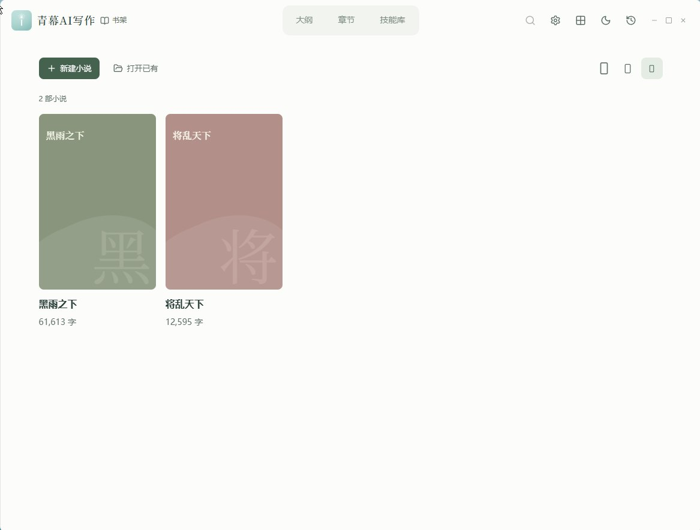

## 界面预览

|  |  |
|---|---|
| 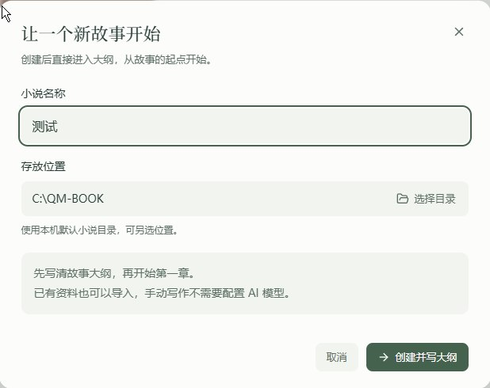 | 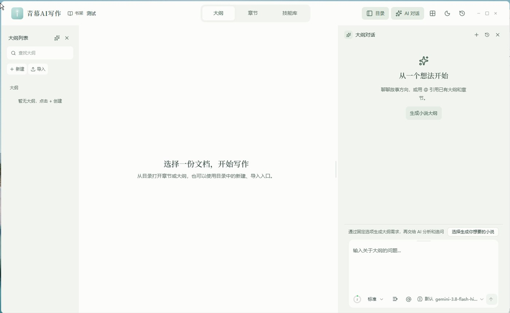 |
| 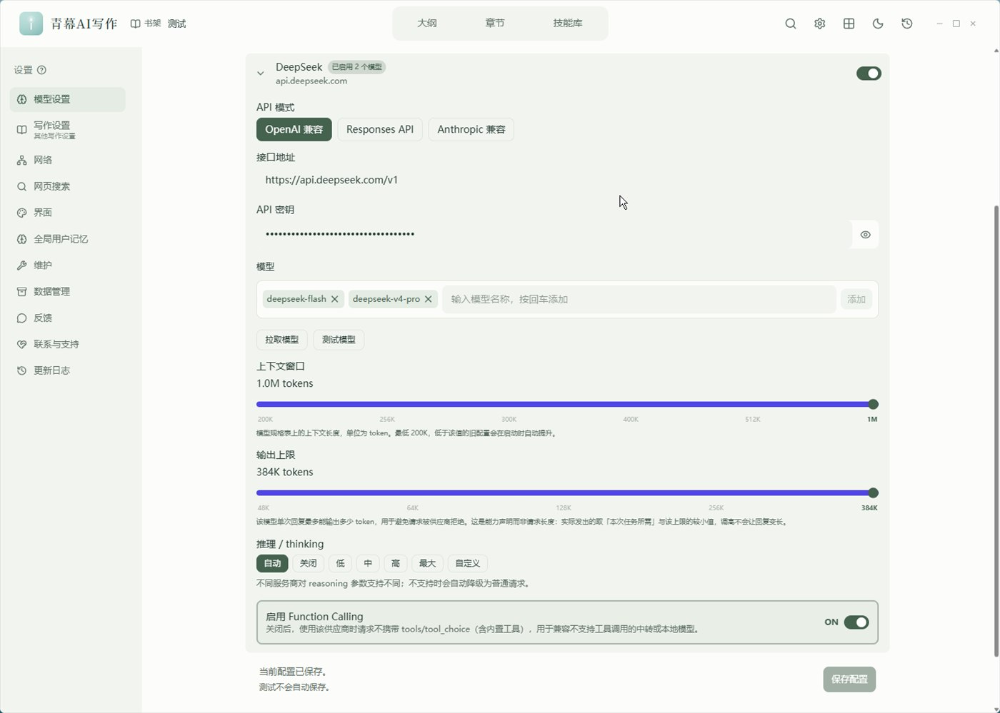 | 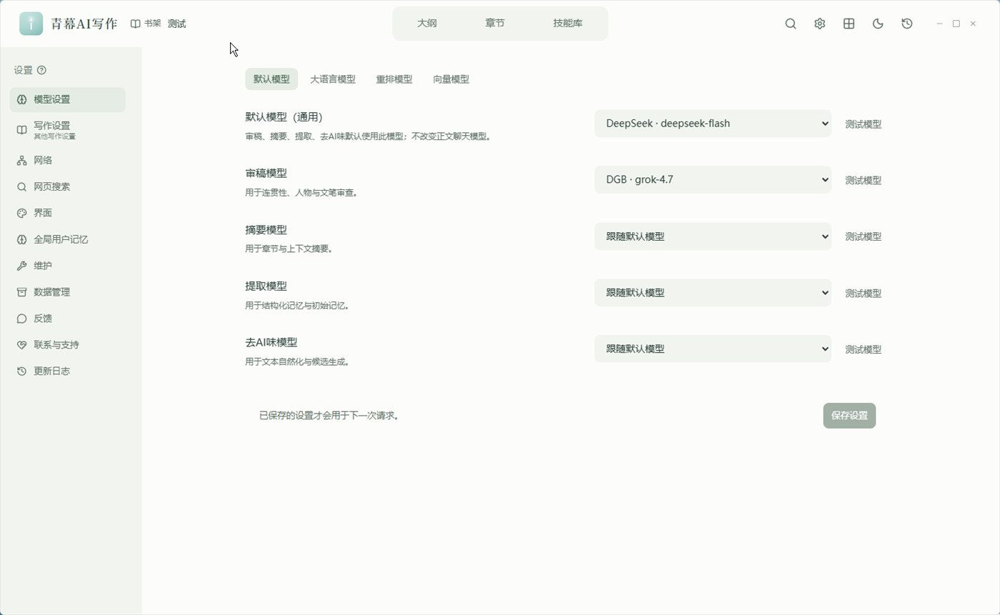 |
| 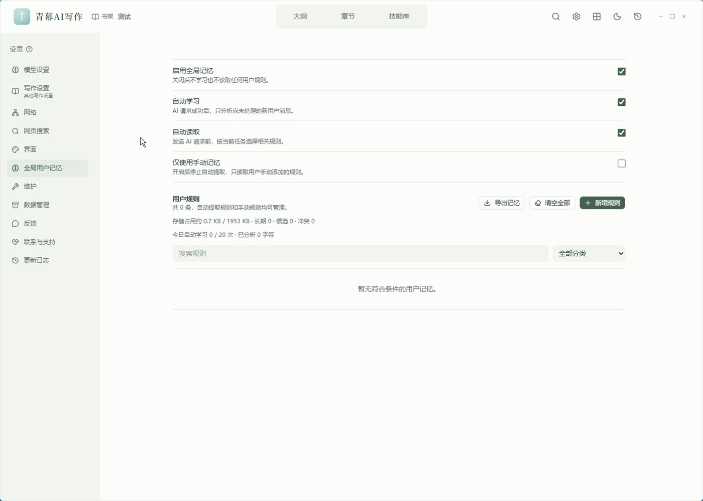 | 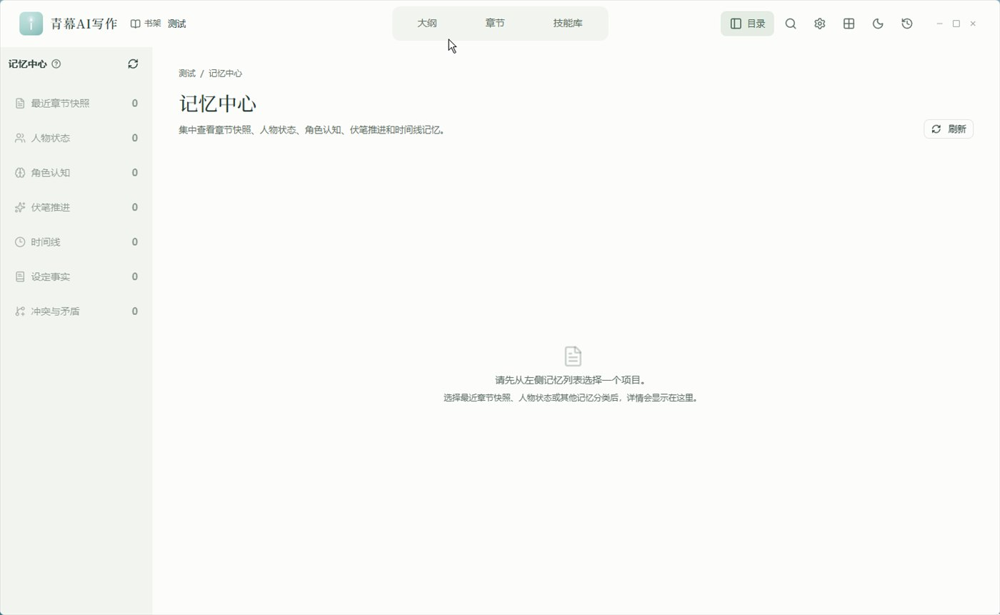 |
| 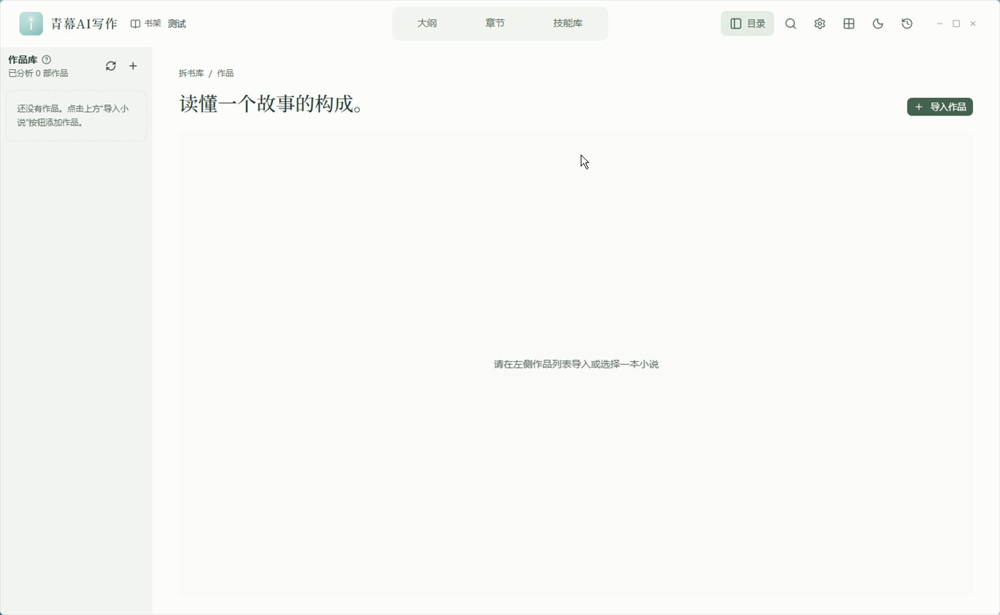 | 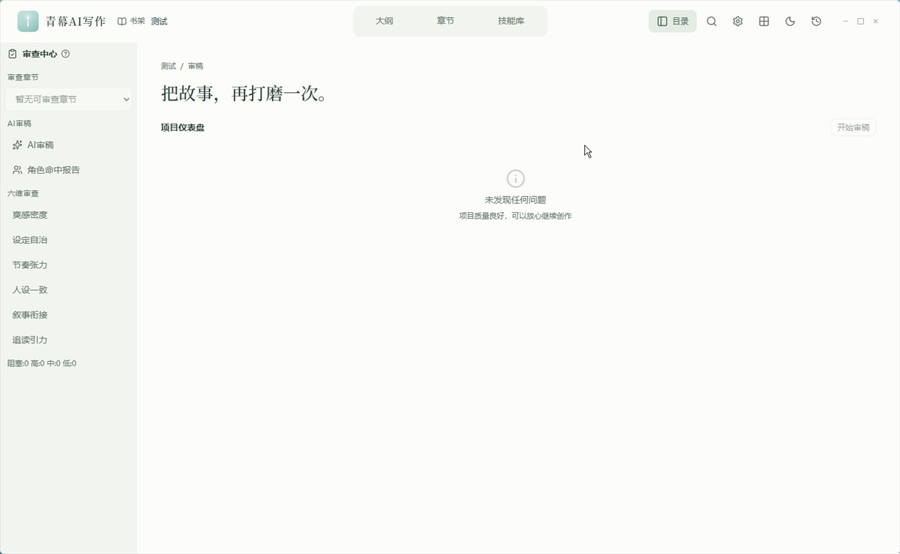 |
| 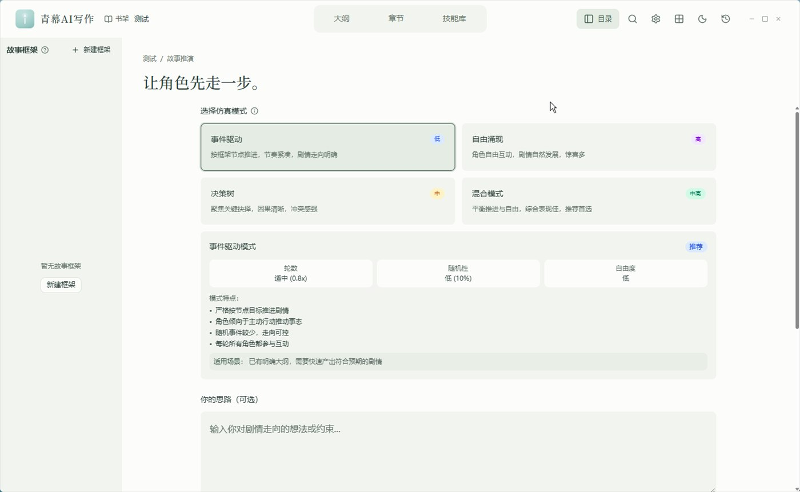 | 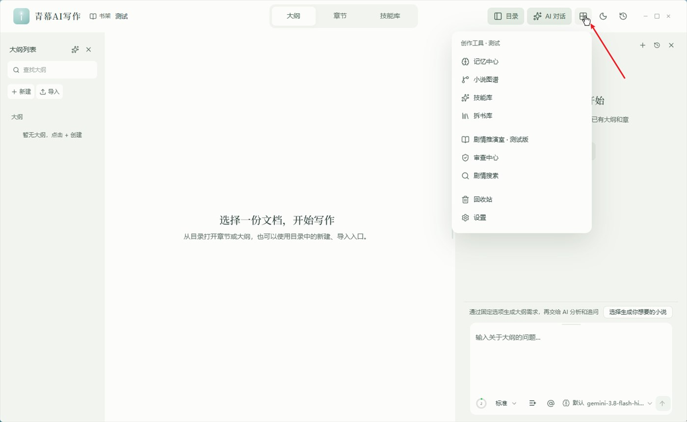 |

> 4.0.0 起界面整体重构（全新界面），顶部功能栏可自定义、窗口自绘无外框。

## 软件概述

青幕AI写作不是普通的 AI 聊天写作工具。它是一套**长篇小说记忆型写作系统**，专为 200 万～300 万字量级的连载小说创作设计。

核心理念：

> 写前自动提取上下文 → 写后自动沉淀章节记忆 → 图谱追踪关系变化 → 审查系统防止崩坏 → 人工确认最终定稿

普通 AI 写作工具的问题在于：写到后期 AI 会遗忘前文、人物性格不一致、时间线混乱、伏笔丢失。青幕AI写作通过结构化记忆系统和混合检索引擎，让 AI 在每次生成时都能"记住"之前的一切。

**适用场景：**
- 网文日更作者：保持长篇连载质量、防止人设崩坏
- 小说策划者：管理世界观、势力关系、多线剧情
- AI 辅助写作者：让大模型在长篇创作中持续可用
- 学习仿写者：通过拆文库拆解成熟作品的角色设定与文风

---


## 核心功能

### 📐 大纲体系（总纲 → 卷纲 → 章纲）

青幕AI写作把大纲拆成**三级、逐级细化**，每一级都能同时产出 **Markdown 文本 + 可视化 HTML**：

| 层级 | 说明 | 可视化形式 |
|------|------|-----------|
| 总纲 | 全书主线、核心设定与整体走向 | — |
| 卷纲 | 按「1 卷 = 10 故事 = 1 大高潮」组织，每个故事固定 10 个环节（起①~合②） | 可折叠 HTML 树：节拍体检、伏笔追踪、人物出场、对手推进、悬念债务、成长资源、地点 / 组织索引 |
| 章纲（细纲） | 按故事**分批**生成，每章写满 17 节（本章定位 / 核心事件链 / 必要条件 / 四段式 / 情绪曲线 / 爽点 / 扩写方式 / 画面细节 / 伏笔钩子 / 角色状态变化 / 设定更新 / 写作约束 / 下一章交接 / 写作检查清单 等） | 章节卡片流 HTML |

- **生成方式**：在「大纲对话」里从一个想法开始，AI 逐步产出；已有卷 / 章可逐级细化，分批任务中断后可续跑。
- **双格式保存**：保存时可分别勾选 Markdown 与 HTML；HTML 由软件读取技能模板渲染，样式统一。
- **保存前体检**：自动校验章号区间、节拍逐位一致、时间线不倒退、人物出场、对手出手、伏笔埋收、检查清单十条固定项等；不完整会自动补全一次，并只重写有问题的批次。
- **写完务必「提取记忆」**：未提取记忆的大纲，AI 在写正文时读不到（详见「基本使用流程 · 第四步」）。

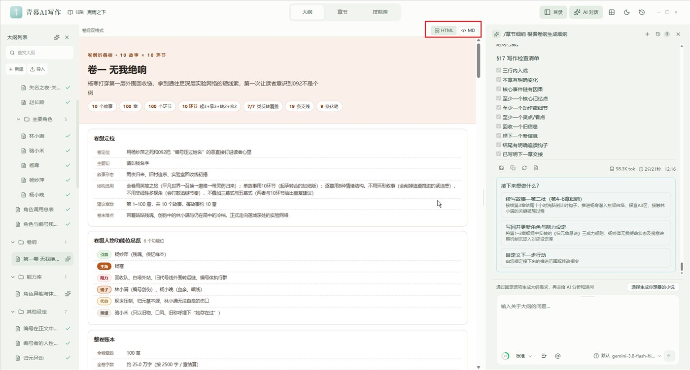

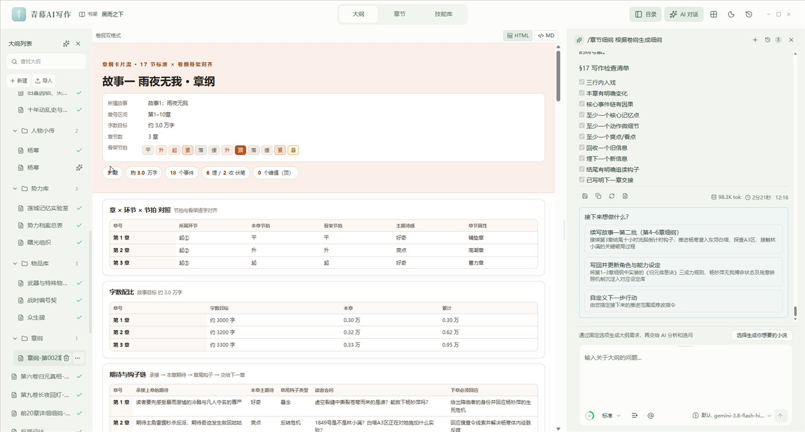

### 📚 记忆系统

记忆系统是青幕AI写作的核心引擎。每章正式保存后，系统会自动执行**章节摄取**，将正文内容结构化为可检索、可追踪、可复用的记忆单元。

**章节摄取提取的内容：**
- 章节摘要与结尾钩子
- 出场人物、地点、组织、物品
- 关键事件与状态变化
- 人物关系变化与角色认知变化
- 伏笔新增 / 推进 / 回收
- 时间线事件
- 图谱节点与关系边

**上下文引擎（写作前自动触发）：**

每次调用 LLM 写作前，系统自动生成**上下文包**，按优先级组装：

```
用户明确指定 > 当前章节细纲 > 上一章结尾 > Canon 正史规则
> 当前人物状态 > 伏笔状态 > 最近章节摘要 > 最近章节正文片段 > 图谱关系
> 向量搜索结果 > 关键词搜索结果
```

上下文包有 token 预算控制，自动在保证关键信息不遗漏的前提下裁剪内容；发送前还会按当前模型的真实输入上限再次裁剪并重试，避免长章节历史超出接口限制。

**混合检索策略：**
- 最近章节窗口：直接获取最近 N 章的正文片段（长章节同时保留开头与结尾）+ 摘要
- 关键词搜索：BM25 风格的精确匹配
- 向量搜索：语义级别的相似内容检索
- 图谱搜索：沿关系边扩展相关节点
- Canon 规则：强制注入的不可违背设定

**数据存储方式：**

所有记忆数据以项目目录形式本地存储，章节正文保存为 Markdown，快照与状态保存为 JSON。支持导出、备份和索引重建。

---


### 🎭 角色灵魂系统

角色灵魂系统由两个层面组成：**项目灵魂** 和 **角色视角（NvwaSKILL）**。

**项目灵魂（Soul Doc）：**

每个小说项目可配置独立的写作灵魂文档，定义整部小说的气质基调：
- 叙事气质（沉浸、克制、轻松等）
- 语言风格（口语感、文学感等）
- 节奏控制规则
- 对话规则与心理描写规则
- 冲突写法与感情线规则
- 禁区列表（禁止空泛抒情、禁止所有人物同一说话方式等）

灵魂文档在每次章节生成时自动注入 LLM 提示词，确保全书风格统一。
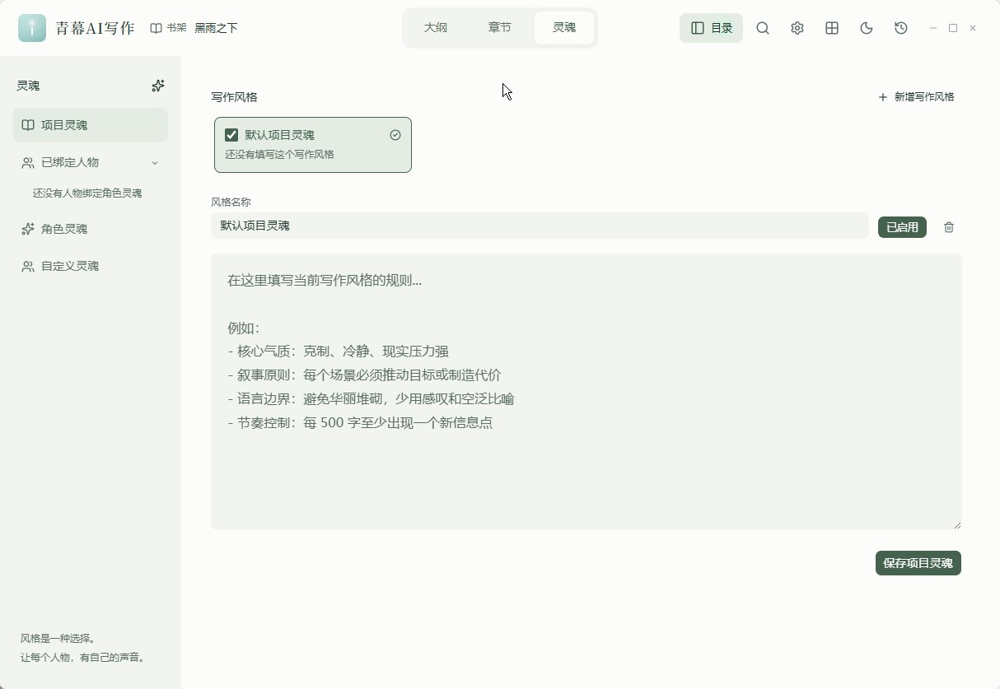

**角色视角（NvwaSKILL）：**

基于 SKILL 框架的角色个性化系统。每个角色视角包含：
- 角色档案与核心设定
- 表达 DNA（说话习惯、用词偏好、句式特征）
- 思维模式与决策风格
- 对话历史与观点参考
- 时间线与关键事件
- 动机、行为模式与代表性台词

系统内置数十个预设角色视角范例（从费曼到鲁迅、从孙悟空到王阳明），用户可参照创建自己小说中的角色模版。也可以通过**拆文库**从已有作品中提取角色，一键加入自定义灵魂库。

**角色认知系统：**

追踪每个角色在每个时间节点"知道什么"和"不知道什么"：
- `knows`：角色已知信息
- `does_not_know`：角色未知信息
- `reader_knows_but_character_does_not`：读者知道但角色不知道的信息（信息差）

这防止了 AI 写作中最常见的错误——让角色知道了不该知道的信息。

---

### 📖 拆文库（作品分析）

拆文库是青幕AI写作的特色功能，让你能够**拆解成熟作品的写作秘密**，并将其复用到自己的创作中。

**拆书工作流：**
1. 导入小说作品（支持整本/多文件/章节范围选择）
2. 章节自动切分，LLM 精准识别真实出场角色（不再用正则抽取无效候选名）
3. 一键提取**角色 Skill**：6 维度人格分析（公开资料 / 说话风格 / 表达 DNA / 外界看法 / 决策模式 / 时间线）
4. 一键提取**作品文风**：9 维度文风指标 + 风格宪法 + 原文代表样本
5. 将角色 Skill 加入自定义灵魂库，或将文风绑定为当前小说的风格约束

**作品文风提取（9 维度）：**

| 维度 | 说明 |
|------|------|
| 叙事密度 / 节奏 | 推进速度与信息投放节奏 |
| 环境描写比重 | 具体实物 vs 抒情氛围的比重 |
| 情绪呈现 | 动作外显 vs 内心独白，以及克制度 |
| 句式与句长 | 长短句倾向、口语化程度 |
| 比喻 / 通感密度 | 修辞出现频率与克制程度 |
| 场景与时间过渡 | 转场和跳时的写法 |
| 叙述视角与声音 | 人称、视角切换与叙述腔调 |
| 对白风格 | 口语 / 毛边 / 潜台词 |
| 点题 / 抒情习惯 | 段尾总结、点题与抒情的频率 |

启用文风约束后，每次生成章节时会自动注入文风预设，保障全书风格统一。

**拆文库特性：**
- 支持重新提取角色 / 重新提取文风
- 后台运行：深度提取可后台执行，各任务进度显示在对应 Skill 页签内，完成后一键跳转结果
- 别名匹配：角色光环支持拼音模糊匹配和简繁转换，昵称也能命中角色设定

---

### 🔍 审查系统

审查系统提供多维度的章节质量把控，分为 **AI 审稿**、**连贯性检查** 和 **角色一致性检查** 三个层面。

**审查中心六维审查：**

| 维度 | 说明 |
|------|------|
| 爽感密度 | 爽点分布是否合理、密度是否足够 |
| 设定自洽 | 战力/地点/时间线等设定是否自相矛盾 |
| 节奏张力 | 叙事节奏是否合理、张弛是否有度 |
| 人设一致 | 角色行为是否偏离人设、对话是否符合性格 |
| 叙事衔接 | 场景转换是否自然、前后文是否衔接 |
| 追读引力 | 章末钩子是否有力、读者期待管理是否到位 |

**AI 审稿流程：**
1. 读取目标章节正文
2. 加载大纲、人物状态、伏笔状态、时间线、角色认知
3. LLM 逐维度检查，输出结构化审稿意见
4. 按严重程度分级：阻塞 / 高 / 中 / 低
5. 提供具体修改建议与原文证据

**角色一致性检查（专项能力）：**

审查阶段会专门校验角色是否脱离记忆库设定：
- AI 先从初稿提取所有出场角色，再逐个对照记忆库（角色光环、人物状态、角色认知状态）
- 标注每个角色的命中状态，判断是否脱离设定
- 审查前用初稿正文重新匹配角色光环，补齐配角、新角色登场时的光环注入缺失
- 长章节（>8000 字）自动分段并行审查（最多 3 段覆盖 24000 字）
- 返修后新增阶段 5.5 复审闭环，确认返修是否引入新阻断问题
- 结果在审查中心以独立的"角色命中记忆库报告"面板呈现

**连贯性检查（Lint）：**

自动检测结构性问题：
- 时间线冲突
- 人设崩坏
- 伏笔错乱
- 角色认知越界
- 缺失的关系引用

每个问题输出包含严重程度、类型、原文证据、相关记忆和修改建议。

**事实检查（Fact Check）：**

基于章节快照的事实验证系统，检测新章节中是否存在与既有 Canon 正史矛盾的内容。

**伏笔债务追踪：**

自动统计长期未回收的伏笔，计算债务评分，提醒作者哪些伏笔需要推进或收束。

---


### ✍️ 小说写作问题解决方案

针对长篇 AI 写作的常见崩坏问题，青幕AI写作提供系统性解决方案：

| 问题 | 解决方案 |
|------|----------|
| AI 写到后期遗忘前文 | 章节快照 + 最近章节正文片段 + 混合检索 + 上下文包自动组装 |
| 人物性格前后不一致 | 角色状态追踪 + 灵魂绑定 + 人设一致性审查 + 角色命中记忆库检查 |
| 时间线混乱 | 结构化时间线 + 连贯性检查 + 时间线冲突报警 |
| 伏笔丢失或错乱 | 伏笔追踪器 + 债务评分 + 自动检测未回收伏笔 |
| 角色知道不该知道的信息 | 角色认知系统（knows / does_not_know） |
| AI 生成错误内容污染后续 | 草稿/正式章节分离 + 人工确认后才入库 |
| 大纲执行偏移 | 大纲一致性审查 + 上下文强制注入大纲规则 |
| 生成内容 AI 味重 | 去AI化改写（De-AI）+ 项目灵魂风格控制 + 作品文风约束 |
| 不知道如何写好某种文风 | 拆文库提取成熟作品的 9 维文风，直接复用 |
| 设定散落难以追踪 | 图谱可视化 + 结构化记忆 + 全文搜索 |
| 长章节超出模型上下文 | 发送前按模型真实输入上限自动裁剪并重试 |

**草稿机制：**

AI 生成的章节默认为草稿状态。草稿支持预览、编辑、重新生成、审稿。只有用户确认后才会保存为正式章节并触发记忆摄取。草稿不会污染正式记忆库。

**去AI化改写（De-AI）：**

内置文风转化能力，将 AI 生成的"标准化"文本改写为更贴近人类写作的自然风格，减少模板化表达。

---

### 🕸️ 图谱功能

小说图谱将作品中的所有实体和关系以网络形式可视化呈现。

**节点类型：**
- 人物、地点、组织、物品
- 事件、章节、大纲
- 伏笔、秘密、冲突、时间点

**关系类型：**
- 出场于、发生于、持有
- 敌对、合作、怀疑、隐瞒
- 知道、不知道
- 推进伏笔、回收伏笔、新增伏笔
- 导致、揭示、影响

**图谱构建逻辑：**

图谱数据来源于章节摄取过程。每当正式章节保存后，系统自动从快照中提取图谱节点和关系边，增量更新全局图谱。

**应用场景：**
- 查看某角色的完整关系网络
- 追踪某个伏笔涉及的所有章节和角色
- 发现孤立节点（缺乏关联的设定）
- 分析剧情线的关键路径

图谱视图基于 Sigma.js + ForceAtlas2 布局，支持社区发现、节点过滤和交互式探索。

---

## 其他功能

- **全新界面**：4.0.0 起界面整体重构；顶部功能栏可自定义、窗口自绘无外框并设最小尺寸，旧版界面已移除
- **大纲管理**：总纲 → 卷纲 → 章纲（细纲）三级体系；支持 AI 生成与逐级细化，卷纲 / 章纲可同时产出 Markdown 与可视化 HTML（折叠树 / 章节卡片流）
- **章节生成**：续写、扩写、改写、润色，多种生成模式；支持章节移动到卷、右键重命名/删除
- **剧情搜索**：关键词 + 语义 + 图谱混合搜索
- **模型管理**：内置预设（DeepSeek、Google、智谱等）多选启用；自定义模型标签式批量管理、批量测试 + 失败重试；「默认模型」机制统筹后台任务
- **数据管理**：一键导出/导入全部数据（AI 会话、大纲、模型、记忆），重装系统可完美恢复
- **技能库**：集中浏览与管理内置 / 自定义写作技能（Skill），可启用、收藏并查看技能说明
- **剧情推演室**：多 Agent 仿真推演——给定情境或注入一个触发事件，推演各角色的行为选择与连锁反应，输出推演报告
- **界面调节**：全局界面字号调节（85%-130%）
- **自动更新**：内置 Tauri Updater，启动时自动检测 GitHub Releases 新版本；Windows 更新前等待主程序释放文件句柄
- **使用说明入口**：大纲、章节、技能库、图谱、记忆中心、灵魂、审查、设置等核心功能图标悬停可查看使用说明

---

## 安装与使用

### 环境要求

- **操作系统**：
  - **Windows**：10 2004 (20H1) / Windows 11，**仅 x64**，CPU 需支持 **AVX2**（Intel Haswell / AMD Excavator 或更新）。需要系统已安装 WebView2。不支持 32 位。
  - **macOS**：13.0+（Ventura），**仅 Apple Silicon（M1 起）**。不提供 Intel 包。
  - **Linux**：**仅 x86_64 / amd64**，CPU 需支持 **AVX2**。Ubuntu 22.04+（webkit2gtk-4.1 / glibc 2.35）。不支持 32 位，不提供 ARM64 包。
- **LLM 服务**：需配置至少一个大语言模型 API（支持 OpenAI 兼容接口、Ollama 等）

### 安装方式

**方式一：下载安装包（推荐）**

前往 [GitHub Releases](https://github.com/Mochocyang/QMAI/releases) 下载最新版本安装包。

**macOS 用户须知**

Release 包未做 Apple 公证，首次打开可能提示「已损坏」或无法运行。将 `.app` 拖入「应用程序」后，在终端执行：

```bash
codesign --force --deep --sign - /Applications/QMaiWrite.app
xattr -dr com.apple.quarantine /Applications/QMaiWrite.app
```

- 第一行：用 ad-hoc 签名让系统允许本地运行
- 第二行：移除下载时附加的隔离标记

macOS 暂不支持应用内自动更新，新版本请手动从 Releases 下载安装。

### 基本使用流程

> 下面按软件实际界面整理：**先配模型 → 再（可选）设默认模型 → 然后进书架开始创作**。

#### 第一步：配置模型

打开软件后，点左侧栏「设置」，进入「模型设置」的「大语言模型」页。模型有两种添加方式：

**方式一：提供方模型（内置服务商，推荐）**
点「+ 添加提供方」，从内置服务商中选择（如 DeepSeek、Google、智谱等），填入 API 密钥即可，接口地址已预置。

**方式二：自定义模型（自建 / 中转 / 本地 Ollama 等）**
点「+ 添加自定义模型」，自行填写名称、接口地址与密钥。

展开任一模型卡片后可以配置：

| 配置项 | 说明 |
|--------|------|
| API 模式 | OpenAI 兼容 / Responses API / Anthropic 兼容 |
| 接口地址 | API 基地址，例如 `https://api.deepseek.com/v1` |
| API 密钥 | 右侧眼睛图标可显示 / 隐藏 |
| 模型 | 输入模型名回车添加，可添加多个；也可点「拉取模型」自动获取 |
| 上下文窗口 / 输出上限 | 拖动滑块，按模型真实能力设置 |
| 推理 / thinking | 自动 / 关闭 / 低 / 中 / 高 / 最大 / 自定义 |
| 启用 Function Calling | 模型不支持工具调用时可关闭 |

配置完成后先点「测试模型」验证连通，再点「保存配置」——**测试不会自动保存**。


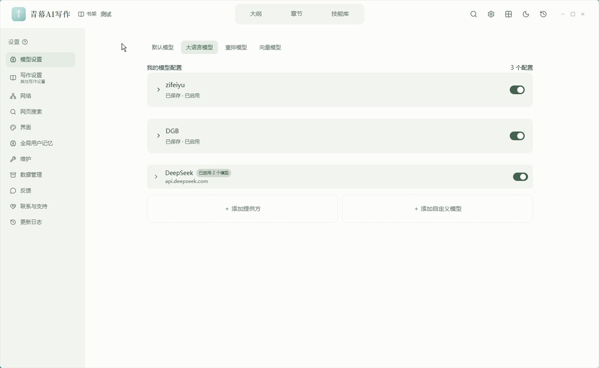

#### 第二步：设置默认模型（可选，可跳过）

在「模型设置 → 默认模型」中，为各类后台任务指定模型：

- **默认模型（通用）**：审阅、摘要、提取、去 AI 味默认使用；**不改变正文聊天模型**
- **审稿模型 / 摘要模型 / 提取模型 / 去 AI 味模型**：可分别指定，或保持「跟随默认模型」
- 每一项都可以点「测试模型」验证；改完点「保存设置」，**已保存的设置才会用于下一次请求**

这一步可以跳过：不设置时，相关任务会沿用当前选择的模型。


#### 第三步：书架

打开软件默认进入「书架」：

- 左上角：**+ 新建小说** / **打开已有**
- 右上角：切换 **列表 / 网格** 视图
- 书架卡片显示小说名称与字数（如「黑雨之下 · 61,613 字」）
- 点「+ 新建小说」弹出「让一个新故事开始」：填写**小说名称**与**存放位置**（默认 `C:\QM-BOOK`，可另选），提示「先写清故事大纲，再开始第一章；已有资料也可以导入，手动写作不需要配置 AI 模型」，点「**创建并写大纲**」直接进入大纲

顶部三个主标签：**大纲 / 章节 / 技能库**，分别对应创作大纲、正文与技能库。


#### 第四步：生成大纲后，务必「提取记忆」（关键）

> 这一步最容易被忽略，但**不做的话，AI 读不到你的大纲**。

**为什么必须提取记忆**

生成或导入的大纲（大章节、卷纲、章纲等）本质上只是文件。**只有执行「提取记忆」之后，系统才会把它结构化写入记忆库，AI 才能在后续对话与章节生成时读取并引用这份大纲的内容**。没有提取记忆的大纲，AI 在写正文时相当于"看不到"。

**在哪里提取**

- 打开该大纲文档，在编辑区右上角工具栏点「**提取记忆**」（大脑图标）。
- 文档标题旁的状态会依次显示：`待提取记忆` → `正在提取记忆` → `已提取记忆`。
- 章节同理：保存为**正式章节**时会自动提取记忆；已提取过的内容修改后，可点「**重新提取记忆**」更新。

**提取后在哪里查看记忆**

- **单篇查看**：工具栏同一排的「**查看记忆**」按钮，查看该篇的记忆快照（未提取时会提示"尚未提取记忆，请先提取"）。
- **全局查看**：左侧栏「**记忆中心**」，集中查看 最近章节快照 / 人物状态 / 角色认知 / 伏笔推进 / 时间线 / 设定事实 / 冲突与矛盾。先从左侧列表选择一个项目，右侧会显示详情。


#### 后续流程

1. **导入或生成大纲**：导入已有大纲，或通过 AI 生成；也可从拆文库提取文风作为风格约束
2. **开始写作**：在「章节」的 AI 对话区输入写作指令（如"继续写第 30 章"）
3. **审阅草稿**：查看生成结果，可编辑、重写或审稿
4. **确认保存**：满意后保存为正式章节，系统自动摄取记忆
5. **查看图谱与审查**：在图谱视图查看人物关系；审查中心查看六维评分与角色命中报告

---

## 常见问题（FAQ）

**Q：大纲写好了，AI 写正文却读不到里面的内容？**
A：多半是**没有提取记忆**。打开该大纲 → 编辑区右上角点「提取记忆」，状态变为「已提取记忆」后才生效；之后若改动过内容，点「重新提取记忆」更新。

**Q：提示「上下文窗口不足」「输出被截断」「丢失前面对话」？**
A：到「设置 → 模型设置 → 大语言模型」，把该模型的**上下文窗口**与**输出上限**按其真实能力**设满**（软件默认值只是相对安全的参考）。切换模型或使用自定义模型时，请分别设置。

**Q：中转站 / 自建服务 / 本地 Ollama 怎么填？**
A：用「+ 添加自定义模型」：「API 模式」选 **OpenAI 兼容**，「接口地址」填到 `/v1` 为止（本地 Ollama 一般是 `http://localhost:11434/v1`），「API 密钥」按服务商要求填写（本地服务可随意填）。

**Q：报错说模型不支持工具调用 / Function Calling？**
A：在该模型配置里**关闭「启用 Function Calling」**，或改用支持工具调用的模型。

**Q：macOS 打开提示「已损坏」/ 无法运行？**
A：Release 包未做 Apple 公证，按上文「macOS 用户须知」执行两条命令即可。

**Q：检查更新没反应？macOS 能自动更新吗？**
A：macOS 暂不支持应用内自动更新，请手动到 [Releases](https://github.com/Mochocyang/QMAI/releases) 下载覆盖安装；其他平台若更新失败，同样手动下载最新包。

**Q：数据存在哪里？换电脑怎么迁移？**
A：所有数据以项目目录形式**本地存储**（新建小说时可指定目录，默认 `C:\QM-BOOK`），除调用 LLM 外不联网。用「设置 → 数据管理」可**一键导出 / 导入**全部数据（AI 会话、大纲、模型、记忆）。

**Q：界面只有中文吗？**
A：当前版本**仅中文界面**（英文界面已移除）。

---

## 本地开发

### 前置依赖

- Node.js 20+
- Rust (stable)
- [Tauri 2 开发环境](https://v2.tauri.app/start/prerequisites/)

### 代码规范

- 前端代码使用 TypeScript 严格模式
- Commit Message 遵循 [Conventional Commits](https://www.conventionalcommits.org/) 规范
- 新功能请在 `src/lib/novel/` 中集中实现，避免散落到无关模块
- Rust 代码遵循 `cargo fmt` 和 `cargo clippy` 标准

---

## 许可证

本项目采用 [GNU General Public License v3.0](LICENSE) 开源许可证（基于 [LLM Wiki](https://github.com/nashsu/llm_wiki) 衍生开发）。

---

## 致谢

- 本项目灵感来源：（webnovel-writer）https://github.com/lingfengQAQ/webnovel-writer
- 项目框架UI设计依托LLM WIKI：https://github.com/nashsu/llm_wiki
- 内置角色灵魂设计参考女娲.skill：https://github.com/alchaincyf/nuwa-skill
- 拆书文风 Writing DNA 参考 writing-dna-skill：https://github.com/larashero3-dotcom/writing-dna-skill
- 语料统计去 AI 味参考 lieflat-less-ai-tone（moxt.ai）：https://github.com/larashero3-dotcom/lieflat-less-ai-tone
- 感谢LINUXDO提供的帮助：https://linux.do/


## 相关链接

- 📦 [Releases 下载](https://github.com/Mochocyang/QMAI/releases)
- 🐛 [问题反馈](https://github.com/Mochocyang/QMAI/issues)
- 💬 [功能建议](https://github.com/Mochocyang/QMAI/issues/new)
